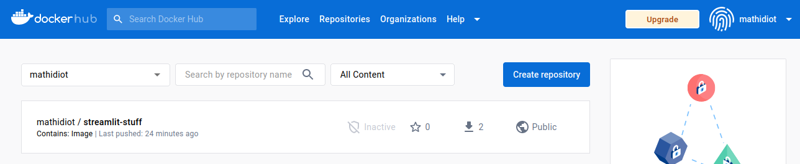

# First Things First
## Open up Docker Desktop

# INSTRUCTIONS PART 1

## Step 1: Run this line of code

```docker pull username/repository-name```

## Step 2: Run this line of code

```docker run -p 8501:8501 username/repository-name```

.
.
.
.
.
.
.
.
.
.
.
.
.
.
.
.   

# INSTRUCTIONS PART 2

## Prerequisites:

 - Make sure you open this folder in VS Code and are inspecting this markdown file in a pretty format.

 - Make sure yout working directory is this folder. 

## Step 1: Create a Docker account

Go to the following website and create an account with github if you haven't already.

[Click Me to Make a Docker Account](https://hub.docker.com/)


## Step 2: Create a Docker Repository

Once you are have created an account, go to the [repositories section](https://hub.docker.com/repositories/) and click the "Create repository" button and name it whatever you want



- Once you do that, you will get a docker repository similar to the one you see above, where it's your docker username, followed by the name of the repository.

(For example, if your username was brighamyoung and your repository is called discourses, your repository path would be called, "*brighamyoung/discourses*")

## Step 3: Building the docker file

(When you are bulding your docker file, make sure you are logged in to your docker account on the docker desktop application on your computer)

-  Now we have to build the docker file to port it to our brand new repository.
-  We do this by using our Dockerfile, which you can browse
- ##### Be sure to replace the username/docker-repository with the appropriate information 

```docker build -t username/docker-repository -f ./Dockerfile .```

## Step 4: Push to your streamlet-docker application
```docker push username/docker-repository```

## Step 5: Pull the docker file
```docker pull username/repository-name```

## Step 6: Start the instance
```docker run -p 8501:8501 username/repository-name```

## Step 7: Launch the server under your localhost
http://localhost:8501/